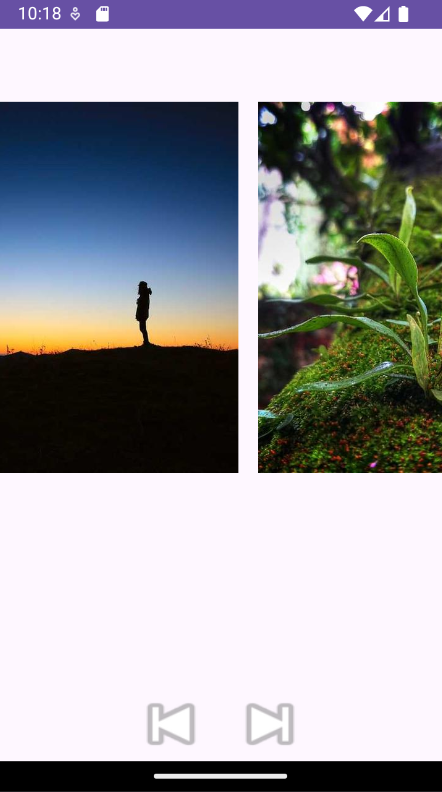

# Carrossel de Imagens Android

Este é um aplicativo simples de Carrossel de Imagens para Android, projetado para proporcionar uma experiência intuitiva de visualização horizontal de imagens.

## Funcionalidades

- **Visualização Horizontal**: Navegue suavemente através das imagens com um layout centrado e limpo.
- **Botões de Navegação**: Botões intuitivos para mover para a imagem anterior ou seguinte.
- **Interface Amigável**: Projetado para facilitar a integração e uso em diferentes aplicativos.

## Exemplo de Uso

